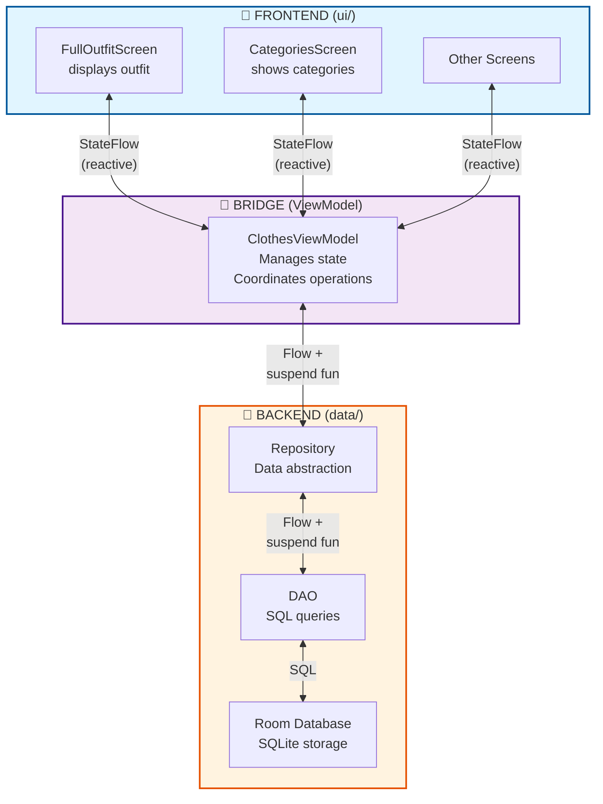
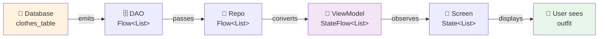
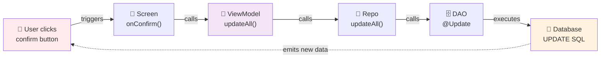
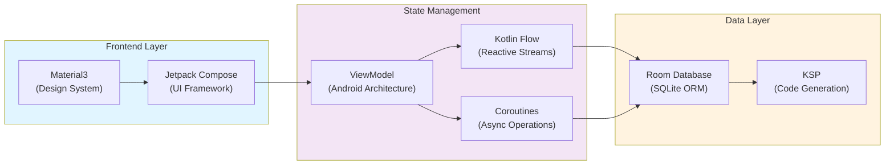
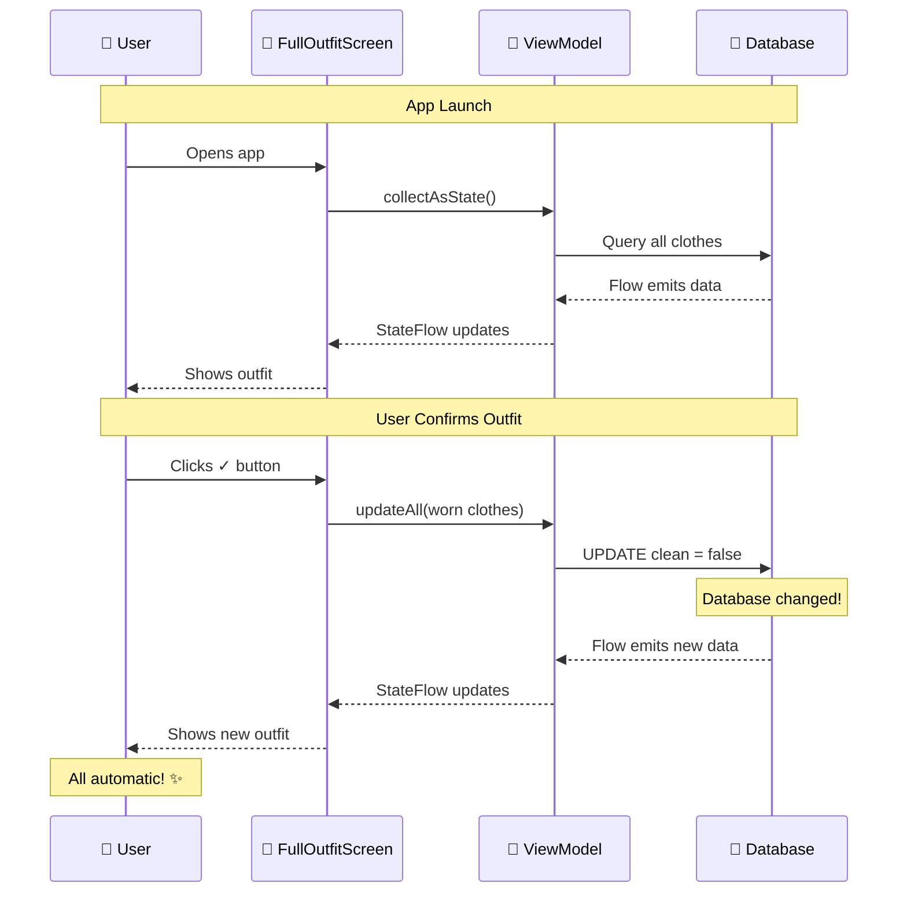
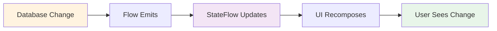
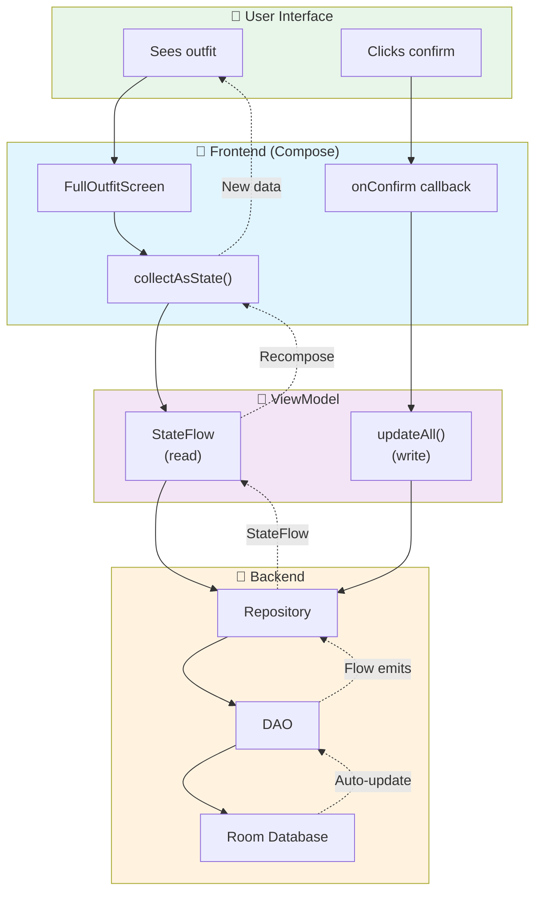

# Frontend-Backend Communication - Visual Summary

## Simple Overview



---

## Communication Types

### 1️⃣ Read Data (Automatic Updates)



**Key:** Data automatically flows from database to UI. When database changes, UI updates automatically! ⚡

---

### 2️⃣ Write Data (User Actions)



**Key:** User action triggers write → Database updates → Reactive flow automatically updates UI! 🔄

---

## Technology Stack



---

## Real Example: Outfit Display

### The Flow



---

## File Organization

### Frontend Files (ui/)

```
ui/
├── screens/
│   ├── FullOutfitScreen.kt        ← Displays outfit (top + pants)
│   ├── CategoriesScreen.kt        ← Shows clothing categories
│   ├── SpecificCategoryScreen.kt  ← Lists items in category
│   ├── ClothInformationScreen.kt  ← Item details
│   ├── ScreenAddNewClothes.kt     ← Add new item form
│   ├── WashingMachineScreen.kt    ← Mark items as clean
│   └── Kamera.kt                  ← Camera integration
│
├── viewmodel/
│   ├── ClothesViewModel.kt        ← State management
│   └── ClothesViewModelFactory.kt ← ViewModel creation
│
├── navigation/
│   ├── NavGraph.kt                ← Screen routing
│   └── Routes.kt                  ← Route definitions
│
└── components/
    ├── Header.kt                  ← Reusable header
    └── LooksyButton.kt            ← Custom button
```

### Backend Files (data/)

```
data/
├── model/
│   ├── Clothes.kt                 ← Main entity
│   ├── Outfit.kt                  ← Outfit entity
│   ├── Size.kt                    ← Size enum
│   ├── Season.kt                  ← Season enum
│   ├── Type.kt                    ← Type enum
│   ├── Material.kt                ← Material enum
│   └── WashingNotes.kt            ← WashingNotes enum
│
├── local/
│   ├── dao/
│   │   ├── ClothesDao.kt          ← Clothes queries
│   │   └── OutfitDao.kt           ← Outfit queries
│   │
│   └── database/
│       ├── ClothesDatabase.kt     ← Database definition
│       └── Converters.kt          ← Type converters
│
└── repository/
    ├── ClothesRepository.kt       ← Clothes data access
    └── OutfitRepository.kt        ← Outfit data access
```

---

## Communication Methods

### Method 1: Reactive Queries (Automatic)

```kotlin
// In Screen
val clothes by viewModel.allClothes.collectAsState()

// Updates automatically when database changes!
```

### Method 2: User Actions (On-Demand)

```kotlin
// In Screen
IconButton(onClick = {
    viewModel.update(modifiedClothes)
})

// Triggers database update, then UI auto-updates via Flow
```

---

## Key Concepts

### 🌊 Flow vs StateFlow

| Type          | Usage                     | Lifecycle                             |
| ------------- | ------------------------- | ------------------------------------- |
| **Flow**      | Backend (DAO, Repository) | Cold - starts on collection           |
| **StateFlow** | ViewModel → UI            | Hot - always active with latest value |

### 🔄 Reactive Updates



**Magic:** All automatic! No manual UI refresh needed ✨

---

## Why This Design?

### ✅ Advantages

1. **Automatic Updates**: UI always shows latest data
2. **Clean Separation**: Frontend doesn't know about SQL
3. **Testable**: Each layer tests independently
4. **Type Safe**: Compile-time error checking
5. **Lifecycle Aware**: Survives screen rotation

### 🎯 Single Responsibility

| Layer          | Responsibility                   |
| -------------- | -------------------------------- |
| **Screen**     | Display UI, handle clicks        |
| **ViewModel**  | Manage state, coordinate actions |
| **Repository** | Abstract data source             |
| **DAO**        | SQL queries                      |
| **Database**   | Store data                       |

Each layer has ONE job! This makes code easier to understand, test, and maintain.

---

## Quick Reference

### Read Data

```kotlin
// 1. Define query in DAO
@Query("SELECT * FROM clothes_table")
fun getAllClothes(): Flow<List<Clothes>>

// 2. Expose in ViewModel
val allClothes: StateFlow<List<Clothes>> =
    repository.allClothes.stateIn(...)

// 3. Observe in UI
val clothes by viewModel.allClothes.collectAsState()
```

### Write Data

```kotlin
// 1. Define operation in DAO
@Update suspend fun update(clothes: Clothes)

// 2. Wrap in ViewModel
fun update(clothes: Clothes) = viewModelScope.launch {
    repository.update(clothes)
}

// 3. Call from UI
Button(onClick = { viewModel.update(modifiedClothes) })
```

---

## Complete Picture



---

## Summary

**Frontend (ui/)** = What user sees and interacts with  
**↕️ Communication** = Reactive Flows + Suspend functions  
**Backend (data/)** = Where data is stored and managed

**ViewModel** = The bridge that makes it all work together! 🌉

The result? A reactive, type-safe app where UI automatically updates when data changes! 🚀
