# Weather Feature - Class Diagram

This diagram shows the structure and relationships between all weather-related classes in the Looksy app, including the geocoding subsystem and permission/location state enums added during UX stabilization.

```mermaid
classDiagram
    %% Application Layer - Dependency Injection
    class LooksyApplication {
        +weatherApiService: WeatherApiService
        +geocodingApiService: GeocodingApiService
        +weatherRepository: WeatherRepository
        +geocodingRepository: GeocodingRepository
        +locationProvider: LocationProvider
    }

    %% Data Layer - Remote API (DTO)
    class WeatherApiService {
        <<interface>>
        +getWeatherByLocation(lat, lon, apiKey, units) WeatherResponse
    }

    class GeocodingApiService {
        <<interface>>
        +getCityCoordinates(cityName, limit, apiKey) List~GeocodingResponse~
    }

    class GeocodingResponse {
        +name: String
        +lat: Double
        +lon: Double
        +country: String
    }

    class WeatherResponse {
        +name: String
        +main: Main
        +weather: List~WeatherInfo~
    }

    class Main {
        +temp: Double
        +feels_like: Double
        +temp_min: Double
        +temp_max: Double
        +humidity: Int
    }

    class WeatherInfo {
        +id: Int
        +main: String
        +description: String
        +icon: String
    }

    %% Data Layer - Domain Model
    class Weather {
        +locationName: String
        +temperature: Double
        +feelsLike: Double
        +description: String
        +humidity: Int
        +iconUrl: String
    }

    %% Data Layer - Location
    class LocationProvider {
        -context: Context
        -fusedLocationClient: FusedLocationProviderClient
        +hasLocationPermission() Boolean
        +isLocationEnabled() Boolean
        +getCurrentLocation() Result~Location~
    }

    class Location {
        +latitude: Double
        +longitude: Double
    }

    class LocationInputMode {
        <<enumeration>>
        GPS
        MANUAL_CITY
    }

    class PermissionState {
        <<enumeration>>
        NOT_ASKED
        GRANTED_WHILE_IN_USE
        GRANTED_ONCE
        DENIED
    }

    %% Repository Layer
    class WeatherRepository {
        -apiService: WeatherApiService
        -apiKey: String
        +getWeather(lat, lon) Flow~Result~Weather~~
    }

    class GeocodingRepository {
        -apiService: GeocodingApiService
        -apiKey: String
        +getCityCoordinates(cityName) Result~Location~
    }

    %% ViewModel Layer
    class WeatherViewModel {
        -repository: WeatherRepository
        -_weatherState: MutableStateFlow~WeatherUiState~
        +weatherState: StateFlow~WeatherUiState~
        +fetchWeather(lat, lon)
    }

    class WeatherViewModelFactory {
        -repository: WeatherRepository
        +create(modelClass) ViewModel
    }

    class GeocodingViewModel {
        -repository: GeocodingRepository
        -_geocodingState: MutableStateFlow~GeocodingUiState~
        +geocodingState: StateFlow~GeocodingUiState~
        +searchCity(cityName: String)
    }

    class GeocodingViewModelFactory {
        -repository: GeocodingRepository
        +create(modelClass) ViewModel
    }

    class GeocodingUiState {
        <<sealed interface>>
    }

    %% UI State (Sealed Interface Pattern)
    class WeatherUiState {
        <<sealed interface>>
    }

    class Loading {
        <<data object>>
    }

    class Success {
        +weather: Weather
    }

    class Error {
        +message: String
    }

    %% UI Composables
    class WeatherIconRow {
        <<composable>>
        +weatherState: WeatherUiState
        +permissionState: PermissionState
        +isLocationEnabled: Boolean
        +onClick: () -> Unit
    }

    %% Relationships - Composition and Dependencies
    LooksyApplication --> WeatherApiService : creates (lazy)
    LooksyApplication --> GeocodingApiService : creates (lazy)
    LooksyApplication --> WeatherRepository : creates (lazy)
    LooksyApplication --> GeocodingRepository : creates (lazy)
    LooksyApplication --> LocationProvider : creates (lazy)

    WeatherRepository --> WeatherApiService : uses
    WeatherRepository --> Weather : returns

    GeocodingRepository --> GeocodingApiService : uses
    GeocodingRepository --> Location : returns

    WeatherViewModel --> WeatherRepository : uses
    WeatherViewModel --> WeatherUiState : manages

    WeatherViewModelFactory --> WeatherRepository : requires
    WeatherViewModelFactory --> WeatherViewModel : creates

    GeocodingViewModel --> GeocodingRepository : uses
    GeocodingViewModel --> GeocodingUiState : manages

    GeocodingViewModelFactory --> GeocodingRepository : requires
    GeocodingViewModelFactory --> GeocodingViewModel : creates

    LocationProvider --> Location : returns
    WeatherIconRow --> WeatherUiState : reads
    WeatherIconRow --> PermissionState : reads

    %% Data structure relationships
    WeatherResponse *-- Main : contains
    WeatherResponse *-- WeatherInfo : contains list

    WeatherApiService ..> WeatherResponse : returns

    %% UI State hierarchy
    WeatherUiState <|-- Loading : implements
    WeatherUiState <|-- Success : implements
    WeatherUiState <|-- Error : implements
    Success *-- Weather : contains

    %% Data transformation flow
    WeatherRepository ..> WeatherResponse : receives from API
    WeatherRepository ..> Weather : converts to

    %% Notes
    note for WeatherRepository "Converts DTO (WeatherResponse)\nto Domain Model (Weather)\nHandles API errors"
    note for WeatherViewModel "Exposes StateFlow for UI\nUses viewModelScope for coroutines\nFollows MVVM pattern"
    note for LooksyApplication "Lazy initialization pattern\nSingleton repository instances\nRetrofit setup with OkHttp"
```

## Key Components

### Application Layer

- **LooksyApplication**: Provides lazy-initialized dependencies for both weather and geocoding features

### Data Layer

- **WeatherApiService**: Retrofit interface — `/data/2.5/weather`
- **GeocodingApiService**: Retrofit interface — `/geo/1.0/direct` (city name → coordinates)
- **WeatherResponse/Main/WeatherInfo**: DTOs from OpenWeatherMap
- **GeocodingResponse**: DTO for geocoding results
- **Weather**: Domain model used throughout the app
- **LocationProvider**: GPS access via `FusedLocationProviderClient`; also exposes `isLocationEnabled()`
- **Location**: Simple latitude/longitude data class
- **LocationInputMode**: Enum (`GPS` / `MANUAL_CITY`) — controls which input path is used
- **PermissionState**: Enum (`NOT_ASKED` / `GRANTED_WHILE_IN_USE` / `GRANTED_ONCE` / `DENIED`) — tracked in WeatherScreen UI

### Repository Layer

- **WeatherRepository**: Bridges WeatherApiService and ViewModel, transforms DTOs to domain models
- **GeocodingRepository**: Resolves city name to `Location(lat, lon)` via GeocodingApiService

### ViewModel Layer

- **WeatherViewModel**: Manages `weatherState: StateFlow<WeatherUiState>`, calls `fetchWeather(lat, lon)`
- **WeatherViewModelFactory**: Creates WeatherViewModel with dependencies
- **GeocodingViewModel**: Manages `geocodingState: StateFlow<GeocodingUiState>`, calls `searchCity(name)`
- **GeocodingViewModelFactory**: Creates GeocodingViewModel with dependencies
- **WeatherUiState**: Sealed interface — `Loading / Success(weather) / Error(message)`
- **GeocodingUiState**: Sealed interface — `Idle / Loading / Success(location) / Error(message)`

### UI Layer

- **WeatherIconRow**: Private composable in `FullOutfitScreen.kt` — compact weather summary always visible in home screen (both outfit and empty-closet state). Shows loading spinner, temperature + emoji on success, or `DomainDisabled` icon when permission not granted.

## Architecture Pattern

This follows the **MVVM (Model-View-ViewModel)** pattern with:

1. **DTO → Domain Model transformation** in the repository
2. **Sealed UI State** for type-safe state management
3. **Flow-based reactive data** for automatic UI updates
4. **Dependency injection** via LooksyApplication
