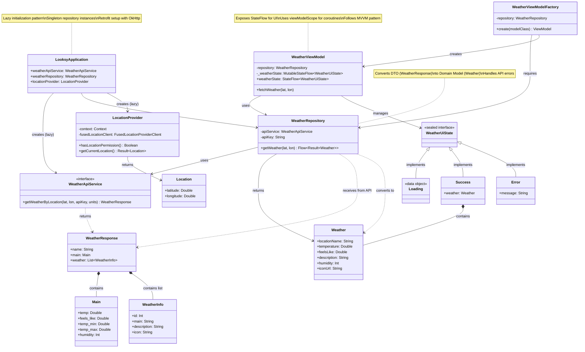

# Weather Feature - Class Diagram

This diagram shows the structure and relationships between all weather-related classes in the Looksy app.

## Key Components

### Application Layer

- **LooksyApplication**: Provides lazy-initialized dependencies for weather feature

### Data Layer

- **WeatherApiService**: Retrofit interface for OpenWeatherMap API
- **WeatherResponse/Main/WeatherInfo**: DTOs (Data Transfer Objects) from API
- **Weather**: Domain model used throughout the app
- **LocationProvider**: Handles GPS location retrieval
- **Location**: Simple latitude/longitude data class

### Repository Layer

- **WeatherRepository**: Bridges API service and ViewModel, transforms DTOs to domain models

### ViewModel Layer

- **WeatherViewModel**: Manages UI state, coordinates data fetching
- **WeatherViewModelFactory**: Creates ViewModel instances with dependencies
- **WeatherUiState**: Sealed interface representing Loading/Success/Error states

## Architecture Pattern

This follows the **MVVM (Model-View-ViewModel)** pattern with:

1. **DTO → Domain Model transformation** in the repository
2. **Sealed UI State** for type-safe state management
3. **Flow-based reactive data** for automatic UI updates
4. **Dependency injection** via LooksyApplication
