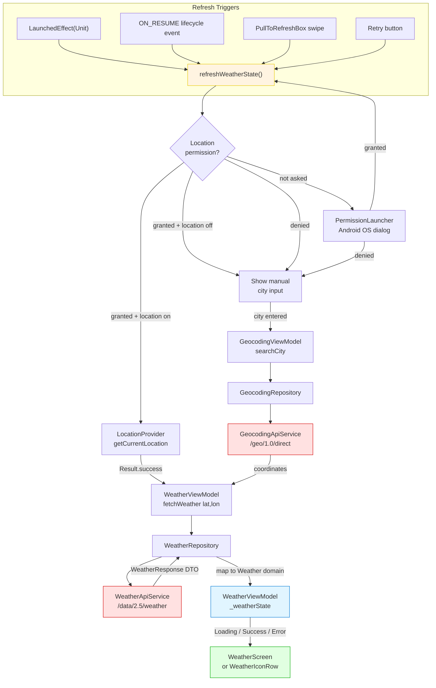

# Weather Feature - Data Flow

This diagram shows the data flow from UI through the unified refresh entry point to the API and back. Includes the geocoding (manual city) fallback path.

## Step-by-Step Flow

1. **Any trigger** (mount / resume / swipe / retry) calls `refreshWeatherState()`
2. **Permission + location check** determines which path:
   - GPS path → `getCurrentLocation()` → `fetchWeather(lat, lon)`
   - Manual city → user types city → `GeocodingRepository` resolves coordinates → `fetchWeather(lat, lon)`
   - No permission → OS dialog → on grant loops back to step 1
3. **WeatherRepository** calls `WeatherApiService`, maps DTO → domain `Weather`
4. **WeatherViewModel** updates `_weatherState` (Loading → Success/Error)
5. **UI** collects `weatherState` via `collectAsState()` and renders accordingly

## Layer Responsibilities

| Layer           | Component                             | Responsibility                                          |
| --------------- | ------------------------------------- | ------------------------------------------------------- |
| **UI**          | `WeatherScreen`                       | Permission flow, refresh coordination, PullToRefreshBox |
| **UI**          | `FullOutfitScreen` → `WeatherIconRow` | Compact weather summary, always visible                 |
| **ViewModel**   | `WeatherViewModel`                    | `weatherState: StateFlow<WeatherUiState>`               |
| **ViewModel**   | `GeocodingViewModel`                  | `geocodingState: StateFlow<GeocodingUiState>`           |
| **Repository**  | `WeatherRepository`                   | DTO→domain mapping, error wrapping                      |
| **Repository**  | `GeocodingRepository`                 | City name → `Location(lat, lon)`                        |
| **Data Source** | `WeatherApiService`                   | HTTP `/data/2.5/weather`                                |
| **Data Source** | `GeocodingApiService`                 | HTTP `/geo/1.0/direct`                                  |
| **Utility**     | `LocationProvider`                    | GPS / `FusedLocationProviderClient`                     |

## Data Types at Each Layer

| Boundary                        | Type                                                  |
| ------------------------------- | ----------------------------------------------------- |
| UI ↔ WeatherViewModel           | `WeatherUiState` (Loading / Success / Error)          |
| UI ↔ GeocodingViewModel         | `GeocodingUiState` (Idle / Loading / Success / Error) |
| ViewModel ↔ WeatherRepository   | `Result<Weather>`                                     |
| ViewModel ↔ GeocodingRepository | `Result<Location>`                                    |
| Repository ↔ API                | `WeatherResponse` / `List<GeocodingResponse>` (DTOs)  |
