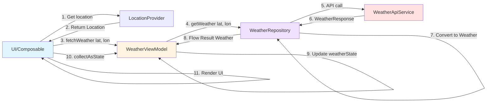

# Weather Feature - Data Flow

This diagram shows the simplified data flow from UI to API and back.

## Step-by-Step Flow

1. **UI requests location** from LocationProvider
2. **LocationProvider returns** latitude and longitude
3. **UI calls fetchWeather()** on WeatherViewModel with coordinates
4. **ViewModel requests data** from WeatherRepository
5. **Repository makes API call** via WeatherApiService (Retrofit)
6. **API returns WeatherResponse** (DTO from OpenWeatherMap)
7. **Repository converts** WeatherResponse → Weather (domain model)
8. **Repository emits** Result<Weather> via Flow
9. **ViewModel updates** \_weatherState (Loading → Success/Error)
10. **UI collects state** via collectAsState()
11. **UI renders** weather data to screen

## Layer Responsibilities

| Layer           | Component         | Responsibility                                |
| --------------- | ----------------- | --------------------------------------------- |
| **UI**          | Composable        | Request location, trigger fetch, display data |
| **ViewModel**   | WeatherViewModel  | Manage UI state, coordinate operations        |
| **Repository**  | WeatherRepository | Transform DTOs, handle errors, provide Flow   |
| **Data Source** | WeatherApiService | HTTP communication with API                   |
| **Utility**     | LocationProvider  | GPS/location access                           |

## Data Types at Each Layer

- **UI ↔ ViewModel**: `WeatherUiState` (Loading/Success/Error)
- **ViewModel ↔ Repository**: `Flow<Result<Weather>>`
- **Repository ↔ API**: `WeatherResponse` (DTO)
- **Repository internal**: `Weather` (domain model)
