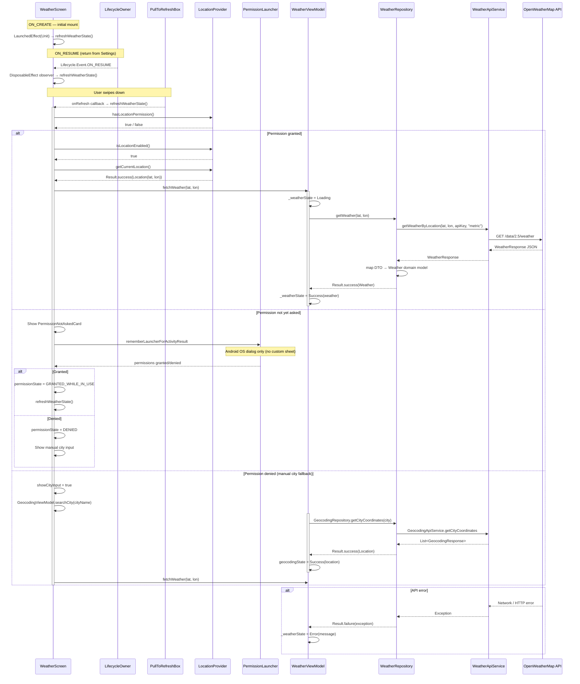

# Weather Feature - Sequence Diagram

This diagram shows the complete interaction flow between components when fetching weather data, including the unified refresh entry point and lifecycle-aware reload introduced in the UX stabilization pass.

## Sequence Breakdown

### Unified Refresh (`refreshWeatherState()`)

All three load triggers (initial mount, `ON_RESUME`, swipe) funnel into a single `refreshWeatherState()` function that:

1. Guards against re-entrant calls (`if (isRefreshing) return`)
2. Checks permission and location state
3. Either requests GPS coordinates → `fetchWeather()` or shows manual city input

### Happy Path (GPS permission granted, location on)

1. `refreshWeatherState()` detects permission + location enabled
2. Calls `locationProvider.getCurrentLocation()`
3. On success calls `weatherViewModel.fetchWeather(lat, lon)`
4. ViewModel sets `Loading`, calls repository, updates to `Success(weather)` or `Error`

### Permission Flow (Android dialog only)

- **No custom bottom sheet** — the OS permission dialog is shown directly
- On grant: `permissionState = GRANTED_WHILE_IN_USE` then `refreshWeatherState()`
- On deny: `permissionState = DENIED`, show manual city input automatically

### Lifecycle Resume Reload

- `DisposableEffect(lifecycleOwner)` adds a `LifecycleEventObserver`
- `ON_RESUME` fires when the user returns from Android Settings
- Calls `refreshWeatherState()` which re-checks newly granted permissions

4. **Repository Data Fetch**
   - ViewModel collects from `repository.getWeather()` Flow
   - Repository calls API service with coordinates and API key

5. **API Communication**
   - WeatherApiService (Retrofit) makes HTTP GET request to OpenWeatherMap
   - Receives `WeatherResponse` JSON (DTO)

6. **Data Transformation**
   - Repository converts `WeatherResponse` → `Weather` domain model
   - Builds icon URL from API icon code
   - Emits `Result.success(Weather)` via Flow

7. **State Update**
   - ViewModel receives success result
   - Updates `_weatherState` to `Success(weather)`

8. **UI Update**
   - UI collects weatherState via `collectAsState()`
   - Receives `Success` state with weather data
   - Renders temperature, description, icon, etc.

### Error Paths

**Permission Denied**

- If location permission not granted, UI shows permission request dialog
- Flow stops until user grants permission

**API Error**

- Network failure, invalid API key, server error, etc.
- Repository catches exception
- Emits `Result.failure(exception)`
- ViewModel sets state to `Error(message)`
- UI displays error message to user

## Key Patterns Used

- **Suspend functions**: All async operations use Kotlin coroutines
- **Flow**: Repository returns reactive Flow for automatic updates
- **Result wrapper**: Type-safe success/failure handling
- **Sealed UI State**: Type-safe state representation (Loading/Success/Error)
- **viewModelScope**: Automatic coroutine lifecycle management

## Timing Notes

- Location retrieval: ~1-3 seconds (GPS/network dependent)
- API call: ~500ms-2s (network dependent)
- Total flow: ~1.5-5 seconds from user action to weather display
