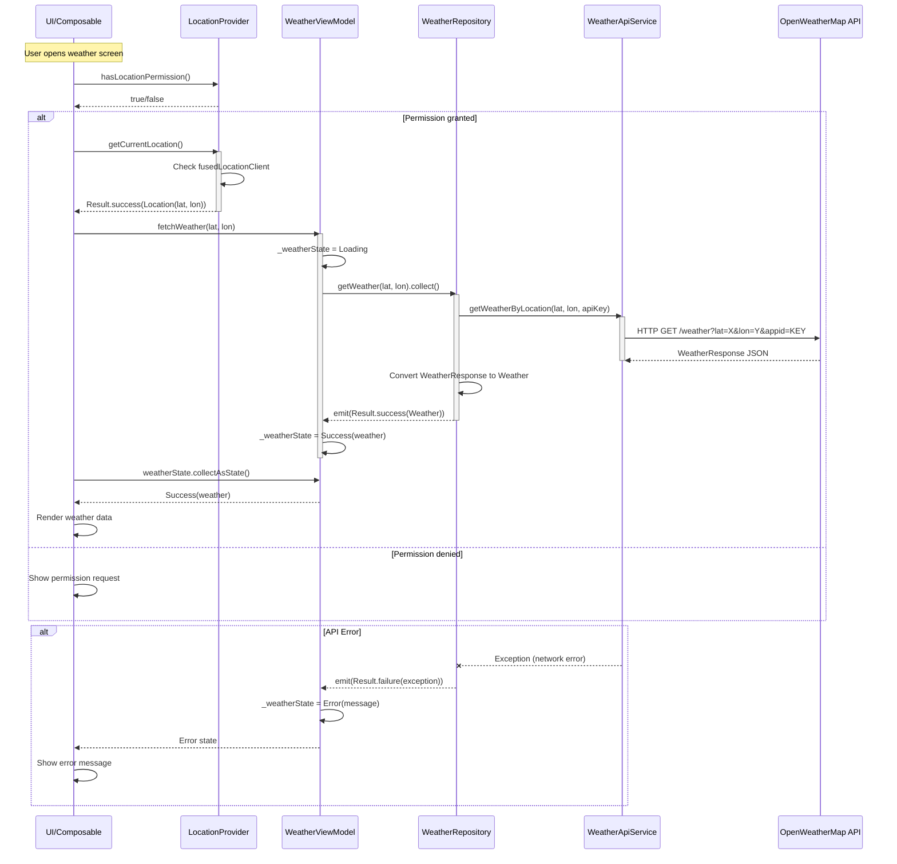

# Weather Feature - Sequence Diagram

This diagram shows the complete interaction flow between components when fetching weather data.

## Sequence Breakdown

### Happy Path (Success Flow)

1. **Permission Check**
   - UI asks LocationProvider if location permission is granted
   - If granted, proceed; otherwise show permission request

2. **Location Retrieval**
   - UI requests current location
   - LocationProvider queries FusedLocationProviderClient
   - Returns `Result.success(Location)` with latitude/longitude

3. **Weather Fetch Initiation**
   - UI calls `fetchWeather(lat, lon)` on ViewModel
   - ViewModel immediately sets state to `Loading`

4. **Repository Data Fetch**
   - ViewModel collects from `repository.getWeather()` Flow
   - Repository calls API service with coordinates and API key

5. **API Communication**
   - WeatherApiService (Retrofit) makes HTTP GET request to OpenWeatherMap
   - Receives `WeatherResponse` JSON (DTO)

6. **Data Transformation**
   - Repository converts `WeatherResponse` → `Weather` domain model
   - Builds icon URL from API icon code
   - Emits `Result.success(Weather)` via Flow

7. **State Update**
   - ViewModel receives success result
   - Updates `_weatherState` to `Success(weather)`

8. **UI Update**
   - UI collects weatherState via `collectAsState()`
   - Receives `Success` state with weather data
   - Renders temperature, description, icon, etc.

### Error Paths

**Permission Denied**

- If location permission not granted, UI shows permission request dialog
- Flow stops until user grants permission

**API Error**

- Network failure, invalid API key, server error, etc.
- Repository catches exception
- Emits `Result.failure(exception)`
- ViewModel sets state to `Error(message)`
- UI displays error message to user

## Key Patterns Used

- **Suspend functions**: All async operations use Kotlin coroutines
- **Flow**: Repository returns reactive Flow for automatic updates
- **Result wrapper**: Type-safe success/failure handling
- **Sealed UI State**: Type-safe state representation (Loading/Success/Error)
- **viewModelScope**: Automatic coroutine lifecycle management

## Timing Notes

- Location retrieval: ~1-3 seconds (GPS/network dependent)
- API call: ~500ms-2s (network dependent)
- Total flow: ~1.5-5 seconds from user action to weather display
